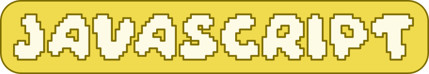
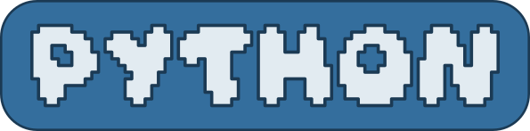
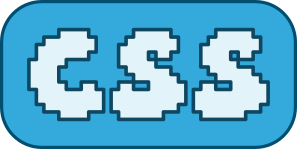
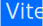

# Nicole Blanchette 
- Welcome! I am currently a full-stack software engineering student.  
- If you want to skip to my favorite projects, check out my pinned section!  
- Also, all the buttons in my tech stack are made by me.
- All my profiles and contacts are linked on the left side of my profile.
## Languages

 

 
### More of my tech stack...

<!--  -->

## Organizations
[cc-nicole](https://github.com/cc-nicole) | My off-platform Codecademy projects  
[NaDa](https://github.com/NaDa-nasa-viewer) | A group project to view NASA images

<!-- ## Statistics -->
<!-- ## More -->
